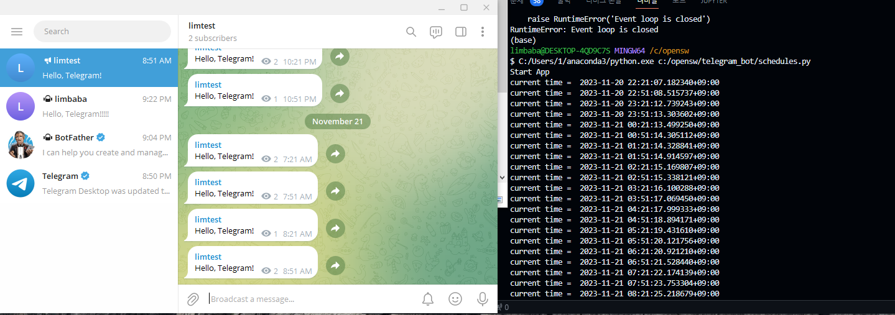

## 🚀 Telegram_bot 만들기

- **30분 단위로 개설 채널에 메시지 전송**
- 참고 (https://tech.lonpeach.com/2021/02/13/python-telegram-restock-bot/) 감사합니다.

## 📖 상세 내용 (코드 & 실행 방법)

[set_up.ipynb](./set_up.ipynb)

- set_up.ipynb 파일에서 30분 단위로 개설 채널에 메시지 전송 코드 & 결과 확인 가능
- 개인 공부용 개인 봇 만들기 + 채널 만들기 방법 및 코드

## 🛠️ 결과

### 사용한 코드

[schedules.py](./schedules.py)

### 결과 이미지

</img> 
